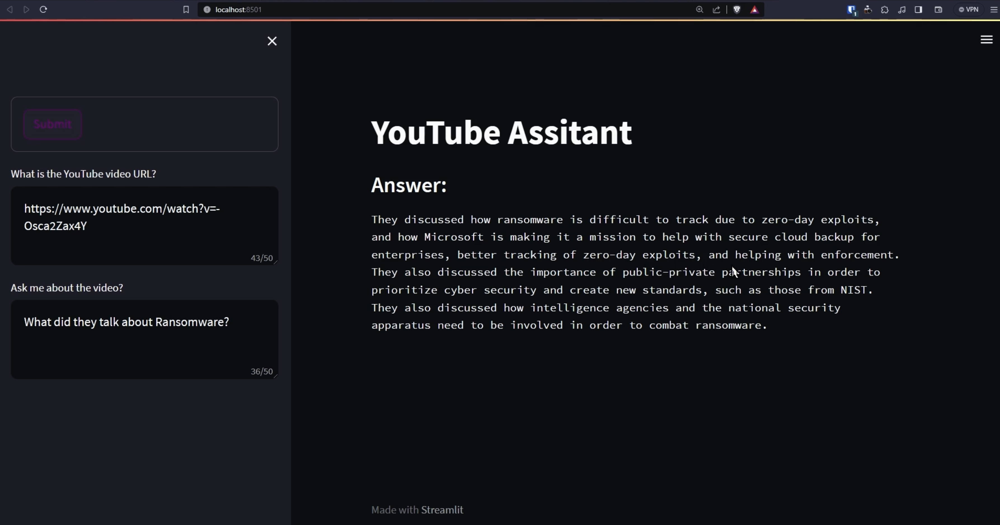

# YouTube Assistant

Faça perguntas sobre qualquer vídeo do YouTube para este assistente desenvolvido pelo LLM..

## Running it locally

Executando localmente:

```bash
pip install -r requirements.txt
```

Execute o aplicativo streamlit:

```bash
streamlit run main.py
```


